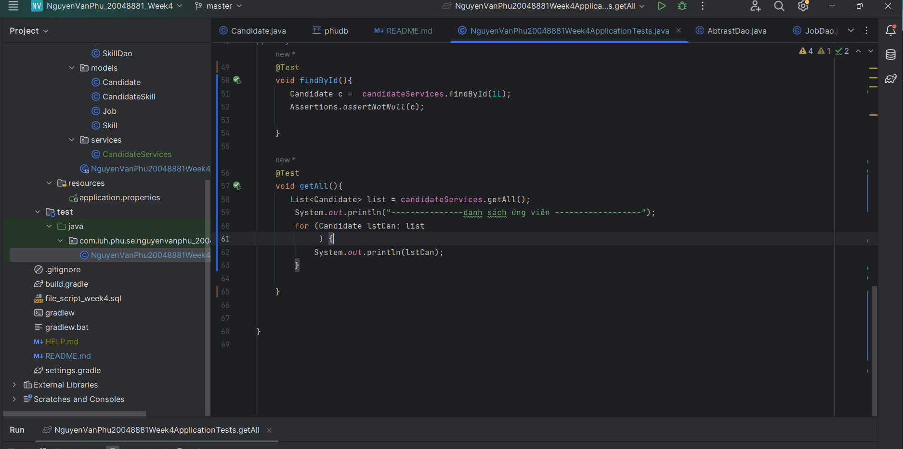

# week04_lab_20048881_NguyenVanPhu
- Sinh viên: **Nguyễn Văn Phú**
**Ý tưởng:** Làm quen với `Spring Boot`.  
**Sử dụng:** `Spring Boot`  `Spring Data - JdbcTemplate`.  
**Mô tả:**  
- Ánh xạ các entity.  
- Sử dụng `JdbcTemplate` để thao tác. 
- Làm quen với `Unit Test`.  
   
- 
 
 
**Diagram:**

